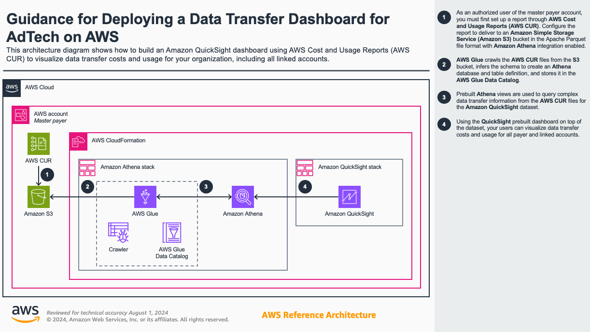
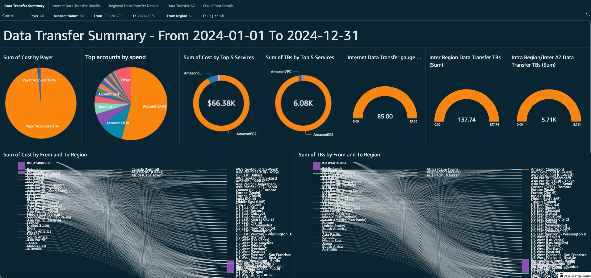

# Visualize Datatransfer Cost and Usage via Amazon QuickSight

## Table of Content

1. [Overview](#overview)
    - [Cost](#cost)
2. [Prerequisites](#prerequisites)
    - [Operating System](#operating-system)
3. [Deployment Steps](#deployment-steps)
4. [Deployment Validation](#deployment-validation)
5. [Next Steps](#next-steps)
6. [Cleanup](#cleanup)
7. [FAQ, known issues, additional considerations, and limitations](#faq-known-issues-additional-considerations-and-limitations)
8. [Revisions](#revisions)
9. [Notices](#notices)
10. [Authors](#authors)

## Overview

This repo contains a cloudformation teamplates for creating Athena view for querying Datatransfer usage and cost data from AWS Cost and Usage report table and QuickSight dashboard to analyze Datatransfer traffic.

The Data Transfer Dashboard is an interactive, customizable and accessible QuickSight dashboard to help customers gain insights into their data transfer usage.

This dashboard contains data transfer breakdowns with the following visuals:

* Amount and cost by service and region
* Between/Inter regions
* Internet data transfer, AWS Global Accelerator usage details for estimation
* Regional Data transfer
* DT AZ/Intra region
* CloudFront cost and usage analysis

### Cost

_You are responsible for the cost of the AWS services used while running this Guidance._

Assumptions:

    Number of working days per month = (22)
    SPICE capacity = (100 GB)
    Number of QuickSight authors = (3)
    Number of QuickSight readers = (15)

Cost breakdown using Calculator:

    S3 cost for CUR: < $5-10/mon**
    AWS Glue Crawler: < $3/mon**
    AWS Athena data scanned: < $7/mon**
    QuickSight Enterprise: <= $24/mon/author or $5max/mon/reader Pricing 

    QuickSight SPICE capacity: < $10-20/mon**
    Total: $100-$200

There is also a free trial for 30 days for 4 users of QuickSight, so the first month's overall cost may be less if a trial period is still available.

**Costs above are relative to the size of your CUR data

### Architecture Overview

### Prerequisits

* AWS Account
* AWS VPC
* AWS Cost and Usage report
* AWS Athena database and table for Cost and Usage report

## Deployment Steps

1. Clone this repository to your development desktop
2. Login to AWS Account in which you wish to deploy this solution
3. Navigate to the CloudFormation service
4. Click on "Upload a template file", Choose file and then select data_transfer_athena.yaml from your local machine
5. Click on Next
6. Provide Stack Name and required parameters for the Stack
7. Click Next and Next again
8. Click on "I acknowledge that AWS CloudFormation might create IAM resources." and Submit

Repeat steps 3-8 above for deploying data_transfer_quicksight_template.yaml

## Deployment Validation

* Open CloudFormation console and verify the status of both the templates with the name starting with stack.
* If deployment is successful, you should see "CREATE_COMPLETE" in the console.

### Expected output
You should be able to see data xxx.

### Output description
DataTransfer QuickSight Dashboard that shows cost and traffic usage for Internet, Regional and AZ traffic along with summary of data transfer usage for your Org.
## Next Steps

Athena Views and Data Transfer QuickSight Dashboard stack is used to visualize the cost and usage based on common scenarios that fetches data for last 3 months. Modify Athena view to increase/decrease scope. Add/Modify the the QuickSight Visuals as per your business needs.

## Cleanup

Deleting CloudFormation stacks deletes resources deployed through the solution. S3 buckets containing CloudWatch log groups are retained after the stack is deleted.

1. Login to AWS Account in which you have deployed this solution
2. Navigate to the CloudFormation service
3. Click on stack for template data_transfer_athena.yaml
4. Click on Delete

Repeat steps 2-4 for data_transfer_quicksight_template.yaml

## FAQ, known issues, additional considerations, and limitations

**Known issues**

- None

**Additional considerations**

- For any feedback, questions, or suggestions, please use the issues tab under this repo.

## Revisions

## Notices

*Customers are responsible for making their own independent assessment of the information in this Guidance. This Guidance: (a) is for informational purposes only, (b) represents AWS current product offerings and practices, which are subject to change without notice, and (c) does not create any commitments or assurances from AWS and its affiliates, suppliers or licensors. AWS products or services are provided “as is” without warranties, representations, or conditions of any kind, whether express or implied. AWS responsibilities and liabilities to its customers are controlled by AWS agreements, and this Guidance is not part of, nor does it modify, any agreement between AWS and its customers.*

## Authors

Chaitanya Shah - Principal Technical Account Manager AWS